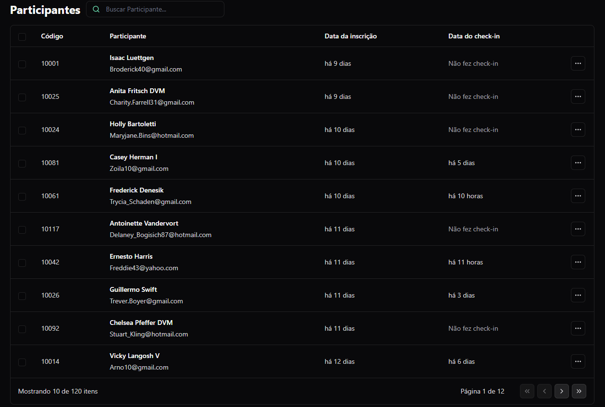
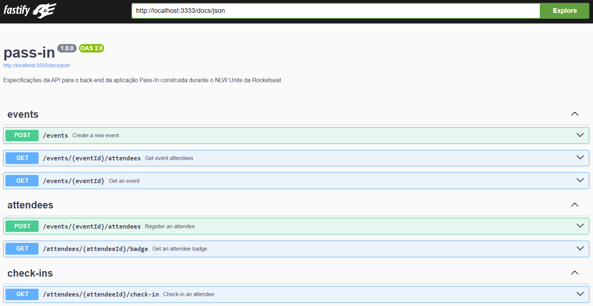
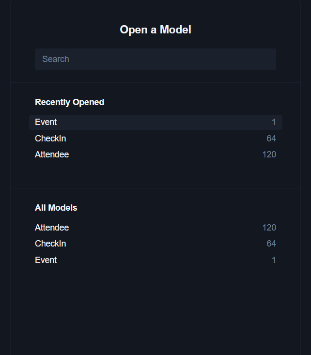

<h1 align="center">🚀 Pass In 🚀</h1>

<p align="center">
Welcome to Pass In Web!
<br> This is a participant listing system for the event. It allows the storage and management of participant information, including check-in date, registration date, name, email, among other details.
<br>
🧡
</p>

<p align="center">
  <a href="#technologies">Technologies</a>&nbsp;&nbsp;&nbsp;|&nbsp;&nbsp;&nbsp;
  <a href="#installation">Installation</a>&nbsp;&nbsp;&nbsp;|&nbsp;&nbsp;&nbsp;
  <a href="#layout">Layout</a>&nbsp;&nbsp;&nbsp;&nbsp;&nbsp;&nbsp;
</p>

<p align="center">
  
  
  
</p>

<br />
<h1 id='technologies'>🖱️ Technologies</h1>

<p>This project was made with the following technologies/libraries:</p>

- TypeScript
- NodeJS
- ReactJS
- Prisma
- TailwindCSS
- SQLite
- Zod
- Fastify
- Git
- Github

<br />

<h1 id='layout'>🖥️ Layout</h1>

<br />

### To make this project, I used this [Figma Design](https://www.figma.com/file/rEwnEO9YCigGlvTOgeUtp1/pass.in-(Community)?type=design&node-id=4003-2975&mode=design&t=z7auUMvO6sWZGj38-0)

<br />

## Getting Started

<h1 id='installation'>📤 Installation</h1>

<h3>Firstly, you need to <strong>clone the project</strong> on your machine:</h3>

```bash
git clone https://github.com/GhabrielMolina/Rocketseat_NLW-Pass
```

<br />

<h3>After that, open the project folder and <strong>install the dependencies:</strong></h3>

```bash
npm install
# or
yarn
#or
pnpm install
```

<h3>To <strong>run the project</strong> on your browser, use in each folder:</h3>

```bash
npm run dev
# or
yarn dev
# or
pnpm dev
```

<br/>

### Database structure (SQL)

```sql
-- CreateTable
CREATE TABLE "events" (
    "id" TEXT NOT NULL PRIMARY KEY,
    "title" TEXT NOT NULL,
    "details" TEXT,
    "slug" TEXT NOT NULL,
    "maximum_attendees" INTEGER
);

-- CreateTable
CREATE TABLE "attendees" (
    "id" INTEGER NOT NULL PRIMARY KEY AUTOINCREMENT,
    "name" TEXT NOT NULL,
    "email" TEXT NOT NULL,
    "event_id" TEXT NOT NULL,
    "created_at" DATETIME NOT NULL DEFAULT CURRENT_TIMESTAMP,
    CONSTRAINT "attendees_event_id_fkey" FOREIGN KEY ("event_id") REFERENCES "events" ("id") ON DELETE RESTRICT ON UPDATE CASCADE
);

-- CreateTable
CREATE TABLE "check_ins" (
    "id" INTEGER NOT NULL PRIMARY KEY AUTOINCREMENT,
    "created_at" DATETIME NOT NULL DEFAULT CURRENT_TIMESTAMP,
    "attendeeId" INTEGER NOT NULL,
    CONSTRAINT "check_ins_attendeeId_fkey" FOREIGN KEY ("attendeeId") REFERENCES "attendees" ("id") ON DELETE RESTRICT ON UPDATE CASCADE
);

-- CreateIndex
CREATE UNIQUE INDEX "events_slug_key" ON "events"("slug");

-- CreateIndex
CREATE UNIQUE INDEX "attendees_event_id_email_key" ON "attendees"("event_id", "email");

-- CreateIndex
CREATE UNIQUE INDEX "check_ins_attendeeId_key" ON "check_ins"("attendeeId");
```

</br>

<div align='center'>

<h2 align='center'>Enjoy this project!</h2>

<br />

Developed with 🧡 by <strong>Ghabriel Molina</strong>

<br />

[](https://www.linkedin.com/in/ghabriel-molina/)
[](https://github.com/GhabrielMolina)

[](https://ghabrielmolina.github.io/MeuPortfolio-WebSite/)

</div>
